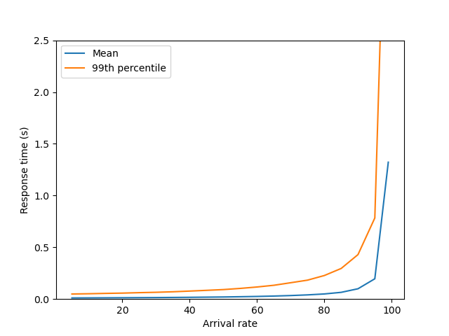
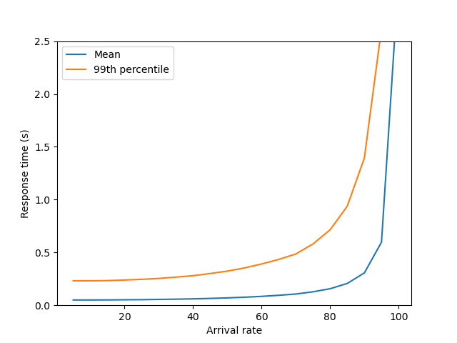
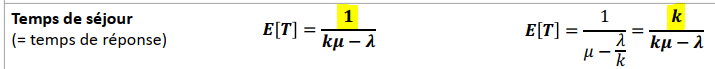
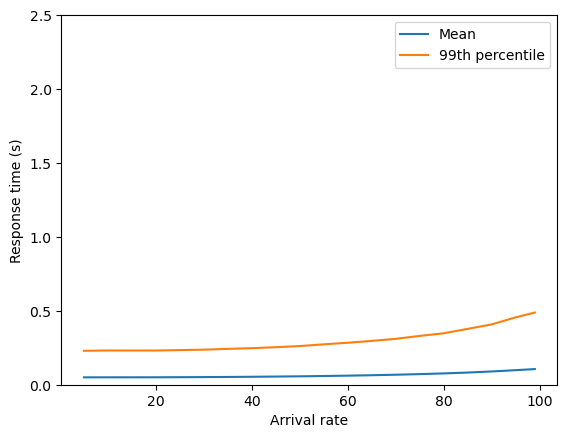
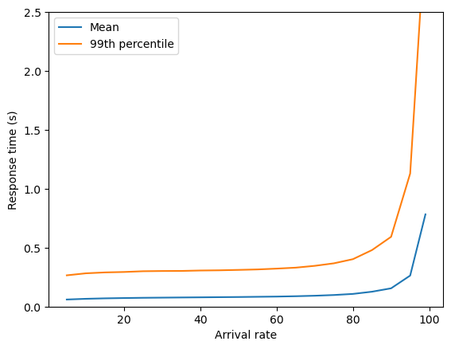
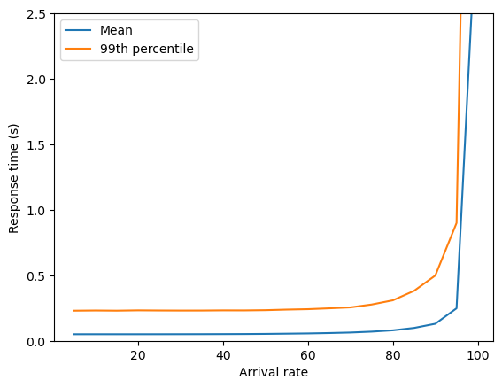
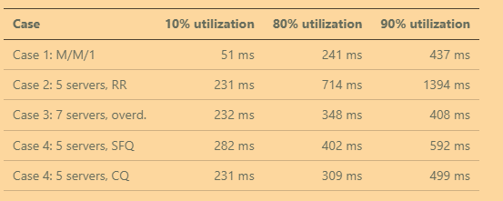
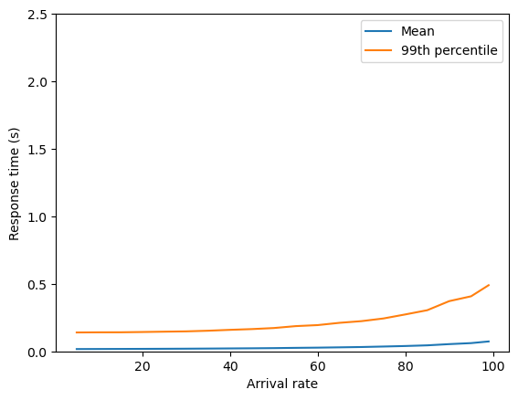

Lab report: Server farms and load balancing
===========================================

> [!NOTE]
> Write your report in this document. You can write it in English or French

Results table
-------------

Fill out the table below to record the simulation results.

Response times (99th percentile) in milliseconds:

| Case                      | 10% utilization | 80% utilization | 90% utilization | 
|---------------------------|----------------:|----------------:|----------------:|
| Case 1: M/M/1             |       51 ms          |   241 ms              |   437 ms              |
| Case 2: 5 servers, RR     |      231 ms           |      714 ms           |   1394 ms              |
| Case 3: 7 servers, overd. |   232 ms              |       348 ms          |     408 ms            |
| Case 4: 5 servers, SFQ    |      282 ms           |      402 ms           |     592 ms            |
| Case 4: 5 servers, CQ     |       231 ms          |       309 ms          |     499 ms            |


Case 1: Base scenario: M/M/1 system
-----------------------------------

Insert the response time plot (mean and 99th percentile) for different utilization levels.



Answer the following questions:

- How does the mean response time change with the load?

> On peut voir que le temps de réponse moyen augmente de manière exponentielle plus la charge augmente.

- How does the 99th percentile change with the load? 

> De manière similaire que pour le temps de réponse moyen, le 99ème percentile augmente de manière exponentielle avec la charge. La seule différence est que le 99ème percentile augmente plus rapidement que la moyenne ce qui est logique car le 99ème percentile est bien plus sensible aux valeurs extrêmes.


Case 2: Load balancing with Round-Robin
---------------------------------------

Insert the response time plot (mean and 99th percentile) for different utilization levels.



Asnwer the following questions:

- Is this system a M/M/k system? Explain why.

> Non ce n'est pas un système M/M/k car il n'y a pas de file d'attente centrale. Chacun des 5 serveurs a sa propre file d'attente donc le système est de type k-fois M/M/1 donc dans notre cas 5-fois M/M/1.
- How do the mean response time and the 99th percentile change with the load?
> De manière similaire au Case 1, le temps de réponse moyen et le 99ème percentile augmentent de manière exponentielle avec la charge. Les temps de réponse sont cependant plus élevés que pour le M/M/1.

- Compare the 99th percentile with the M/M/1 system at a low utilization level (e.g., 10%). What do you observe?
> Comme vu en cours, on peut voir que le temps de réponse est k-fois plus élevé que pour le M/M/1. Ici vu qu'on a 5 serveurs, le temps de réponse est 5 fois plus élevé que pour le M/M/1 comme on peut le voir car 231 ms ≈ 5 * 51 ms.

- Compare the 99th percentile with the M/M/1 system at a hight utilization level (e.g., 90%). What do you observe?

> Pareil, c'est le même comportement donc 5 fois plus élevé car 1394 ms ≈ 5 * 437 ms (ici c'est une très grosse approximation, on est plus à 3,5 fois plus lent mais en théorie ça devrait être environ 5 fois plus lent. Il faudrait tester avec un nombre de requêtes plus élevé pour avoir un résultat plus précis).
- Why is the performance of the load balancing system worse than M/M/1 at low utilization levels?
> Parce qu'on a un facteur k (ici 5) qui multiplie le temps de réponse. On le voit bien notamment dans la formule du temps de réponse moyen:


>C'est même intuitif en y réfléchissant un peu car même si on a 5 serveurs ils restent tout de même 5 fois plus lents que le serveur unique pour traiter une requête.
- Why is the performance of the load balancing system worse tha M/M/1 at high utilization levels?
> Pareil, le principe reste le même, on a toujours un facteur k, comme on le voit dans la formule, peu importe le niveau d'utilisation.


Case 3: Overdimensioning RR
---------------------------

In case 2 we've simulated a load balancing system where each servers has 1/5 of the capacity of the single server in the M/M/1 system. We've observed that the load balancing system is less efficient.

How many servers are needed, such that the load balancing system has the same 99th percentile response time as the M/M/1 system at 90% utilization?

> Il nous faut 7 serveurs pour que 99ème percentile soit similaire à celui du M/M/1 à 90% d'utilisation. Avec 7 serveurs on trouve 408 ms pour le 99ème percentile à 90% d'utilisation ce qui est proche de 437 ms du M/M/1.

Show the plot with the response times for this configuration here and interpret the results.

  

> On voit que contrairement au deux autres plot nous n'avons pas une  courbe exponentielle comme pour les deux autres cas. Le temps de réponse augmente de manière plus linéaire. Ceci s'explique par le fait qu'avec 7 serveurs on a une capacité plus elevée que les deux  autres cas. En effet, le taux de service (μ) est ici de 140 contrairement à 100 pour les deux autres cas. Or on ne touche pas au taux d'arrivée (λ) qui est toujours au maximum de 99 ce qui fait qu'on n'arrive jamais au point critique ou λ ≈ μ qui expliquait l'explosion du temps de réponse de manière exponentielle des deux autres cas.

Increasing the number of servers improves the performance of the load balancing system for *high loads*. Is it possible to improve the performance for *low loads* as well?

> Non, ce n'est pas possible, en tout cas pas en ajoutant simplement plus de serveurs. 

> Si le système a un niveau d'utilisation bas, alors il n'y aura pas ou alors qu'une très petite file d'attente. La file d'attente étant négligeable on compare donc un serveur avec un taux de service à 20 contre un serveur unique avec un taux de service à 100. Inévitablement le serveur unique sera donc 5 fois plus rapide et on aura donc un temps de réponse 5 fois plus rapide que pour le load balancing avec 7 serveurs ou plus.

Case 4: Improving the load balancing system
------------------------------------------

Describe the results obtained from the two algorithms (shortest-queue-first and central queue). How do they compare with the round-robin scheduling and with the M/M/1 system?

> Ci-dessous, les graphiques des deux algorithmes et le tableau complet.

> SQF: 




> CQ:




>  Sans surprise, le système M/M/1 reste le plus rapide lors d'utilisation basse du système ce qui est logique comme expliqué plus haut dans le Case 3. 

> Ce qui est plus intéressant de comparer sont les 99ème percentile lors d'utilisation haute du système. On peut voir que le système avec RR est le plus mauvais ce qui est logique car il est "bête", il n’implémente aucun algorithme d'optimisation du choix de serveurs. 

> On a ensuite SFQ qui est meilleur que RR mais moins bon que les 2 autres systèmes. Ceci est du au fait que bien qu'il prend en compte la taille de la file d'attente, il ne prend pas en compte le temps de réponse/de service du serveur (par exemple on pourrait avoir un serveur avec une toute petite file d'attente mais qui est entrain de traiter une requête très longue et complexe). 

> Finalement on a CQ et M/M/1 qui ont des temps plus ou moins comparables lors d'utilisation haute du système. Vu que CQ est un système M/M/k ceci est attendu vu que nous avons vu dans la théorie que le temps de réponse d'un système M/M/k est le même que celui d'un système M/M/1 lors d'utilisation élevée du système.


> Au final, les résultats obtenus correspondent bien à ce que nous avons vu en théorie. Avec M/M/1 qui viendrait s'inserer entre SITA et CQ.


Case 5: Mixing servers
----------------------

This case considers a mix of a fast and slower server. 

Provide your answers to the questions for the mixed server configuration.

- If you only consider the throughput, which configuration is better: only the fast server, or both servers?

> De manière logique avoir deux serveurs est mieux pour le débit. En effet, avec un seul serveur rapide, on a un débit maximum de 100 req/s tandis qu'avec deux serveurs, on a un débit maximum de 120 req/s.

- Can you find a configuration where the response time is better with only the fast server?

> Oui, à des niveaux d'utilisation faibles, la configuration avec un seul serveur rapide est plus performante car les demandes ne sont pas retardées par l'envoi au serveur lent. Le serveur rapide seul traite toutes les demandes rapidement sans partager la charge avec un serveur plus lent qui introduira des temps de réponse plus longs ce qui augmentera inévitablement le temps de réponse moyen et le 99ème percentile.

- Can you find a configuration where the response time is better with both servers?

> Oui, à des niveaux d'utilisation très élevés, le fait d'avoir les deux serveurs permet de réduire les temps de réponse car la capacité supplémentaire du serveur lent permet d'éviter/de réduire l'accumulation de requêtes dans la file d'attente du serveur rapide. On peut le voir notamment sur le graphique ci-dessous généré par la simulation:



> On peut aussi voir cela dans la tableau de résultats que j'ai obtenu avec la simulation. Par exemple pour 90% d'utilisation, le 99ème percentile est de 437 ms pour le serveur rapide seul (comme calculer au Case 1) et de 372 ms pour les deux serveurs.

> Le tableau permet aussi de confirmer que le serveur seul est meilleur pour les niveaux d'utilisation faibles. Par exemple, pour 10% d'utilisation, le 99ème percentile est de 51 ms pour le serveur rapide seul et de 141 ms pour les deux serveurs.

> Ci-dessous, le tableau des résultats complet:
```
Results:
Arrival rate | Mean response time | 99th percentile |
------------:|-------------------:|----------------:|
           5 |              0.017 |           0.140 |
          10 |              0.017 |           0.141 |
          15 |              0.018 |           0.141 |
          20 |              0.018 |           0.143 |
          25 |              0.019 |           0.146 |
          30 |              0.020 |           0.148 |
          35 |              0.021 |           0.153 |
          40 |              0.022 |           0.159 |
          45 |              0.023 |           0.165 |
          50 |              0.024 |           0.173 |
          55 |              0.026 |           0.187 |
          60 |              0.027 |           0.194 |
          65 |              0.030 |           0.211 |
          70 |              0.032 |           0.224 |
          75 |              0.036 |           0.244 |
          80 |              0.040 |           0.274 |
          85 |              0.045 |           0.305 |
          90 |              0.054 |           0.372 |
          95 |              0.061 |           0.408 |
          99 |              0.073 |           0.490 |
```

Conclusion
----------

Document your conclusions here. What did you learn from the simulation results?

> Ce laboratoire m'a permis d'acquérir différentes connaissances sur les clusters et les systèmes de load balancing. 

> Voici un petit résumé des conclusions que j'ai pu tiré de ce laboratoire:
>1. Un serveur rapide unique est plus performant que plusieurs serveurs plus lents lorsque l'utilisation est faible. Ceci est du notamment au facteur k dans les temps de réponse qui rend ces systèmes avec plusieurs serveurs intrinsèquement plus lents.
>2. Les algorithmes de load balancing sont importants pour optimiser les performances des systèmes distribués.
>    - Round Robin (RR) est simple mais inefficace car il ne tient pas compte de l'état du serveur.
>    - L'algorithme SQF améliore les performances en tenant compte de la longueur des files d'attente.
>    - CQ est le plus performant car c'est une implémentation du système M/M/k.
>3. Implications pour la conception de systèmes :
>       - De manière générale, pour les charges relativement faibles et prévisibles et ou l'état est important (stateful): 
>          - utiliser moins de serveurs, plus puissants => scale vertically 
>    - De manière générale, pour les charges relativement élevées et imprévisibles et ou l'état n'est pas important (stateless): 
>        - utiliser plusieurs serveurs avec du load balancing intelligent => scale horizontally
>     - Les architectures de file d'attente centrale valent la peine d'être mises en œuvre si le temps de réponse est un facteur important.
>     - Lorsque l'on mélange des serveurs de vitesse différente dans un cluster, la distribution pondérée est essentielle.


